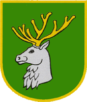
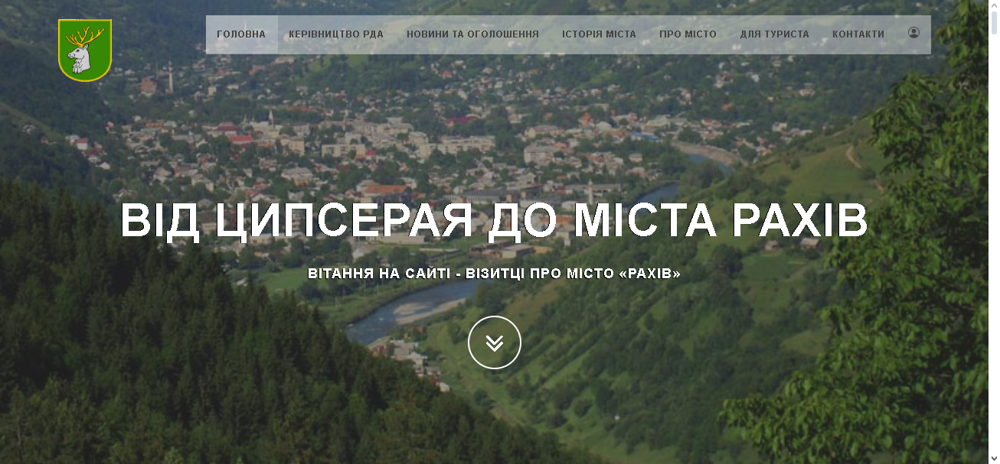
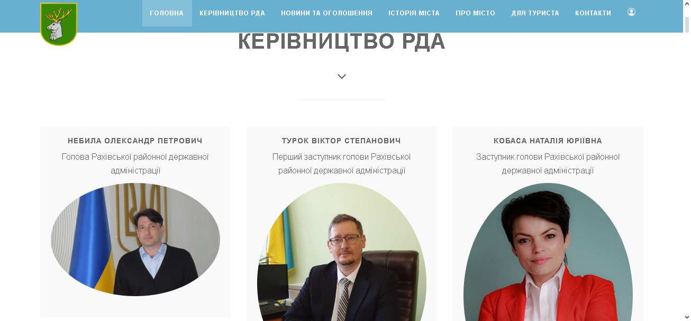
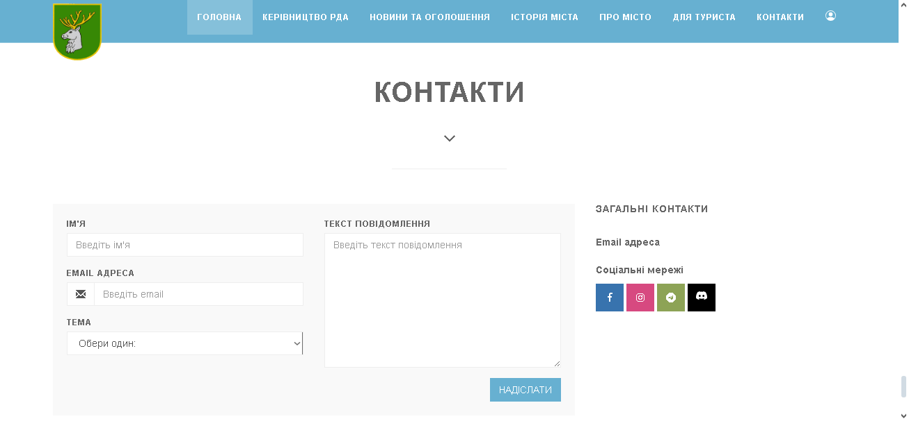
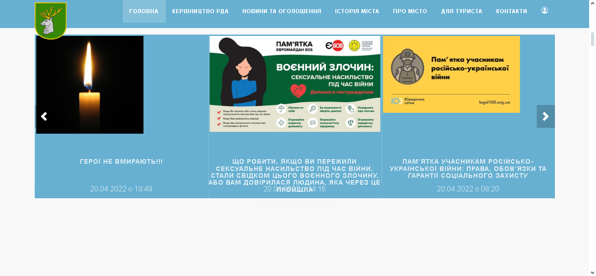
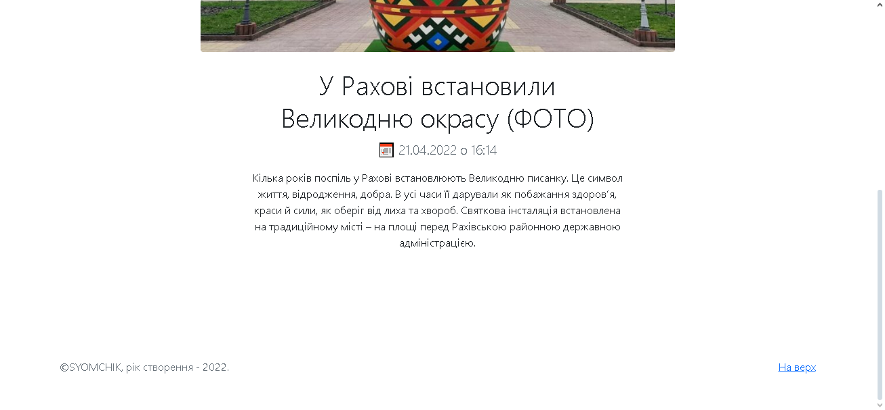

<p align="center"></p>
<h1 align="center">city-of-rakhiv</h1>

## Description
<b>EN:</b>

This is a revised version of the course project that was ordered from me ([from-tsipserai-to-the-city-of-rakhiv](https://github.com/CoolOtaku/from-tsipserai-to-the-city-of-rakhiv) ).

The project visualizes the work of the site (landing) with publications for tourists for the city of Rakhiv. Using its own API.

<b>UA:</b>

Це доопрацьована версія курсового проекту який в мене заказали ([from-tsipserai-to-the-city-of-rakhiv](https://github.com/CoolOtaku/from-tsipserai-to-the-city-of-rakhiv)).

Проект візуалізує роботу сайту (лендінг) з публікаціями для туриста для міста Рахів. З використанням власного API.

#
## Screenshots
<p>
  
  
  
  
  
</p>

#
## Technologies used
<b>EN:</b>
- Using Bootstrap (front-end framework)
- Using a third-party template for site layout (built on Bootstrap)
- Creating your own API
- Navigation on the site

<b>UA:</b>
- Використання Bootstrap (front-end framework)
- Використання стороннього шаблону для макета сайту (на основі Bootstrap)
- Створення власного API
- Навігація по сайту
#
## License
```
© 2022, CoolOtaku (ericspz531@gmail.com)
```
